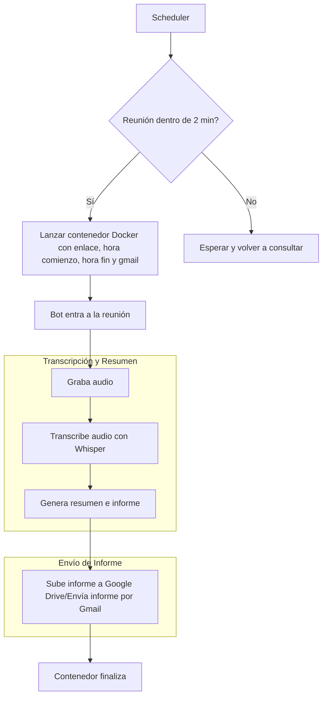

# Introducción del supuesto

La propuesta consiste en **crear una herramienta que se conecte automáticamente a reuniones de Google Meet, capture el audio, lo transcriba y genere un resumen con puntos clave y tareas**. Esta información deberá ser enviada posteriormente al responsable de la reunión. Además buscamos que esta herramienta sea fácil de implementar y clara para el usuario.

En la asignación del proyecto **se establece como punto de partida el repositorio [Google-Meet-Bot](https://github.com/dhruvldrp9/Google-Meet-Bot)**, cuyas funcionalidades incluyen:

- Inicio de sesión y acceso automatizados a Google Meet
- Grabación de audio de reuniones
- Transcripción con Whisper de OpenAI
- Análisis de reuniones que incluye:
	- Resumen
	- Extracción de puntos clave
	- Identificación de acciones
	- Análisis de sentimientos
- Compresión automática de audio si se excede el límite de tamaño
- Resultado JSON del análisis de reuniones

# Problemas técnicos detectados

Tras analizar el repositorio proporcionado hemos detectado una serie de problemas que dificultan el correcto funcionamiento del mismo y su integración de cara a nuestros objetivos: 

### Captación de audio

- El código original recoge el audio del micrófono del equipo donde se ejecuta no el audio general de la llamada. Además una de las sus primeras acciones es silenciar dicho micro, **por lo que el input para la transcripción y el análisis es nulo.**
### Conexión automatizada a las reuniones

- La conexión a las reuniones de Google Meet se realiza mediante acciones automatizadas con la interfaz web por lo que **cualquier cambio en la interfaz o en la secuencia de pasos por parte de Google supondría un fallo en la ejecución del programa**. 
- Con la versión actual más reciente (Apr 2, 2025) **ya existen conflictos en el acceso a la reunión debido a cambios en la interfaz de Google Meet**.

# Soluciones temporales

### Captación de audio

Se consiguió captar el audio general del equipo mediante mediante la activación del *"mezclador estéreo"* como dispositivo de audio. Este permite la mezcla del audio de entrada (micrófono) y el de salida (altavoces) en una única pista que se puede tratar como input.
##### Limitaciones:

- El *"mezclador estéreo"* es una característica propia de Windows y algunas tarjetas de sonido, por lo que no sirve para equipos Mac o Linux[^2].

### Conexión automatizada a las reuniones

Se ha actualizado el código para que funcione con la interfaz actual

# Posibles implementaciones
### 1. Integración con Google Workspace

Este supuesto requeriría acceso a las funciones de transcripción y/o grabación de la propia plataforma Google Meet disponibles con los planes Business Standard, Business Plus, Enterprise Starter, Enterprise Standard, Enterprise Plus, Teaching & Learning Upgrade, o Education Plus de Google Workspace[^1]. Esta solución permitiría evitar los problemas del repositorio original con la captación del audio y utilizar solo las funcionalidades enfocadas al análisis del contenido.

De esta forma utilizaríamos un Addon de Woogle Workspace para generar un nuevo elemento en la interfaz con el que el usuario pueda interactuar para iniciar la herramienta. Activarlo mandaría una señal a nuestro servidor que posteriormente podría adquirir los datos de la reunión a través de la Meet API y realizar su procesamiento.

![[ESP_Google_Workspace_Implementation.excalidraw 1|2500]]

### 2. Boot independiente

En este caso se alojaría el script modificado en un servidor desde el que, con una cuenta propia, accedería a las reuniones. Estas modificaciones incluirían también un modulo adicional que se encargue de observar su horario en busca de nuevas reuniones o modificaciones a las mismas y poner en funcionamiento al bot cuando se acerque el comienzo de una.

Para activarlo el usuario debería añadir la cuenta del bot como participante a la hora de crear la reunión.

![[ESP_Bot_Implementation.excalidraw 1 1|1500]]

# Propuesta elegida y por qué

Debido a las limitaciones impuestas por el entorno de Google Workspace se ha elegido la segunda opción, para e que se presenta el siguiente **plan de realización:**

### Esquema de flujo general

  

  

### Descripción de las partes

#### 📦 Contenedor 1: `scheduler`

**Función**: Detecta reuniones próximas en Google Calendar y lanza un contenedor grabador por cada una.

##### ✅ Responsabilidades

- Consultar la API de Google Calendar.

- Detectar reuniones con enlace de Google Meet.

- Lanzar contenedor `bot-grabador` con:

    - Enlace de Google Meet.

    - Hora de inicio.

    - Hora de finalización.

    - Gmail del creador de la reunión (opcional).

##### 🔁 Flujo interno

- **Google API Client**: para autenticación y lectura del calendario.

- **Python + `subprocess` (+ directo y simple/usa shellscripting) o `docker` SDK (fácil de escalar, robusto/necesita acceso al socket de Docker e instalar el Docker SDK)**: para lanzar contenedores dinámicamente.

#### 🤖 Contenedor 2: `bot-grabador`

**Función**: Unirse a la reunión, grabar audio, transcribirlo, generar informe y enviarlo.

##### ✅ Responsabilidades

- Unirse a Google Meet como bot (cuenta de Google).

- Grabar la reunión hasta la hora de finalización indicada.

- Transcribir el audio.

- Generar resumen e informe con puntos clave y acciones, además de la emoción de dicha reunión.

- Enviar el informe por correo/subir a nube en donde se guarden todos los informes.

##### 🔁 Flujo interno

- **Selenium + Chrome (con Xvfb)**: macro en el navegador simulando un entorno gráfico para que se ejecute.

- **PulseAudio(servidor de sonido para sistemas Linux) + ffmpeg/sounddevice**: captura del audio de la máquina real en `.wav`.

- **Script de transcripción con OpenAI API y Whisper**: transcripción del audio, resumen y extracción de puntos clave.

- **Smtplib(gmail)/DropBox API - GoogleDrive API**: envío del informe a una dirección de correo especificada (creador de la reunión) o subida a la nube.

  
#### 🔌 Flujo entre contenedores

El contenedor `scheduler` ejecuta el `bot-grabador` pasando tres parámetros (o cuatro):

- `URL` de la reunión de Google Meet.

- `Hora de inicio` en formato ISO (`2025-04-04T19:00:00`).

- `Hora de finalización` en formato ISO (`2025-04-04T19:30:00`).

- `Gmail` del creador de la reunión (opcional, para enviar el informe al creador de la reunión).

#### 🛠️ Requisitos de configuración

##### Credenciales de Google
  
Para que el bot funcione, se necesita obtener las credenciales en formato JSON para la autenticación de la cuenta de Google.

Luego de esto se incluirán en un volumen de Docker para que el contenedor `scheduler` pueda acceder a ellas.

___
[^1]: No todas las ediciones de Google Workspace permiten grabar y transcribir reuniones, consulta más información [aquí](https://support.google.com/meet/answer/9308681?hl=en#zippy=%2Crequirements-to-record-a-video-meeting:~:text=You%20can%20record,meeting%20recording.)
[^2]: Existen otras adaptaciones posibles para estos sistemas operativos, pero requerirían un desarrollo distinto para cada uno de ellos.
